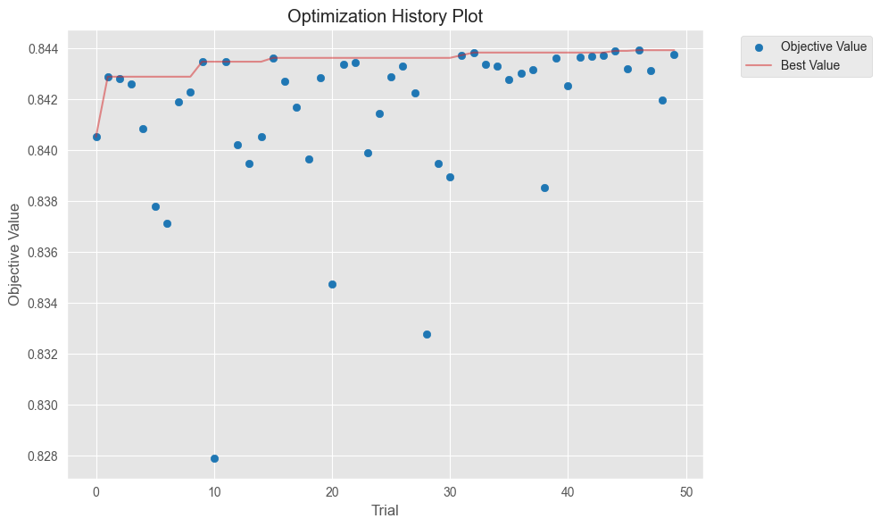
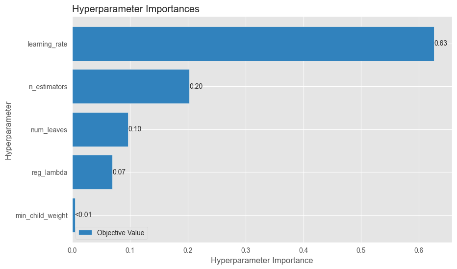
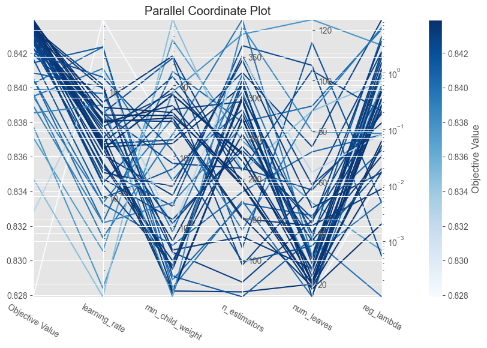
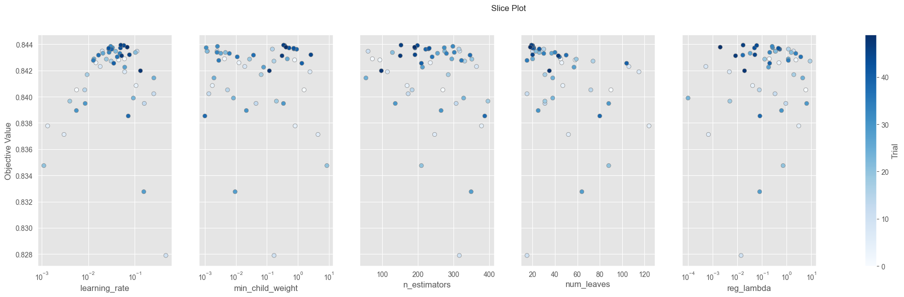

# PS5 Report: Heart Disease Risk Scoring Module

**Name:** Krunal Savaj
**Date:** March 22, 2026

---

## Executive Summary

I built and tested a few different machine learning models to predict heart disease risk for a state health microsimulation. I ended up recommending the **XGBoost** or **Tuned LightGBM** models depending on what's strictly needed. XGBoost is simply the fastest during inference, while Tuned LightGBM is close behind. Both of them totally blow Random Forest  in terms of speed, which is crucial since the simulation has to score millions of people. 

---

## Model Comparison

Here are the results for all the baseline models from the notebook:

| Model | Natl AUC | Maine AUC | Train Time (s) | Inference Time (s) |
|-------|----------|-----------|-----------------|---------------------|
| Decision Tree | 0.5878 | 0.5793 | 1.4451 | 0.0233 |
| Random Forest (200) | 0.8021 | 0.7817 | 52.0893 | 3.3790 |
| HistGradientBoosting | 0.8442 | 0.8333 | 2.2817 | 0.0704 |
| XGBoost | 0.8438 | 0.8322 | 1.1294 | 0.0295 |
| LightGBM | 0.8432 | 0.8316 | 1.6336 | 0.1143 |
| Tuned LightGBM | 0.8447 | 0.8329 | 2.5185 | 0.2311 |

---

## Justification of Model Selected for Tuning

When picking a model to tune with Optuna, I went with **LightGBM**. Looking at the Pareto analysis, XGBoost was technically dominating it by being a bit faster and slightly higher on AUC. However, LightGBM is highly customizable and trains super quickly using histogram-based splitting. This speed was super important because I needed to run 50 full Optuna trials without freezing my computer forever, which would have happened if I tried tuning a Random Forest or an exact-split XGBoost.

---

## Tuning Results

| Metric | Default LightGBM (Problem 2) | Tuned LightGBM (Problem 3) | Change |
|--------|---------------------|--------------------|--------|
| National AUC | 0.8432 | 0.8447 | 0.0015 |
| Maine AUC | 0.8316 | 0.8329 | 0.0013 |
| Training time | 1.6336 | 2.5185 | 0.8850 |
| Inference time | 0.1143 | 0.2311 | 0.1167 |

---

## Final Commentary

One big issue with using BRFSS survey data for this simulation is that it measures prevalence (who currently has heart disease) instead of incidence (who will get it next year). The simulation ticks forward year by year, so it really needs annual transition probabilities, not a lifetime snapshot. 

I was happy to see that tuning didn't hurt our out-of-distribution performance on the Maine dataset; in fact, the Maine AUC bumped up slightly (+0.0013). Still, applying this model to completely bizarre synthetic populations could be risky because it heavily depends on national proxy correlations from 2022.

Based on the calibration check, I definitely wouldn't feed these raw probabilities straight into the simulation. The Random Forest is systematically over-confident (staying below the diagonal for predictions > 0.3), meaning it predicts a higher risk than reality. On the flip side, Tuned LightGBM is under-confident in the 0.3-0.7 range (above the diagonal). They literally have opposite problems. If we use them as-is, we'd systematically overestimate or underestimate the total cases.

If I had more time, I would run the probabilities through Platt scaling or isotonic regression on a hold-out set to properly calibrate them. I'd also play around with XGBoost tuning to see how far I could push the inference speeds down.
